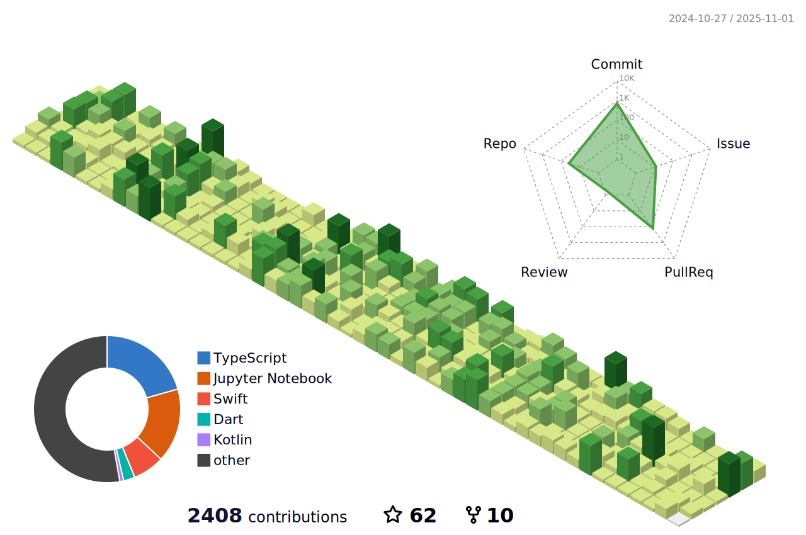

    
    
    
    
       

<!--   my-header-img -->

<!--   my-ticker -->

<!--   my-skils -->

| Property              | Data                                                                                                                                                                                                                                                                                                                                                                                                                                                                                                                                                                                                                                                                                                                                                                                                                                                              |
| --------------------- | ----------------------------------------------------------------------------------------------------------------------------------------------------------------------------------------------------------------------------------------------------------------------------------------------------------------------------------------------------------------------------------------------------------------------------------------------------------------------------------------------------------------------------------------------------------------------------------------------------------------------------------------------------------------------------------------------------------------------------------------------------------------------------------------------------------------------------------------------------------------- |
| **Language / IDE**    |                                                                                                                                                                                                                                                                                               |
| **Domain Knownledge** |                                                                                                                                                                                                                                             |
| **CI / CD**           |                                                                                                                                                                                                                                                                                                                                                                                                                                                                                                                                                                 |
| **Databases**         |   |
| **OS**                |                                                                                                                                                                                                                                                                                                                                                                                                                                                                                                                                                                                                                                       |

### 📈 GitHub Activity Graph:

| .                                                                                                                                                 | .                                                                                                                              |
| ------------------------------------------------------------------------------------------------------------------------------------------------- | ------------------------------------------------------------------------------------------------------------------------------ |
|  |  |

</img>

<!--  -->

<!-- </img> -->

**📫 How to Reach me:**

## Star History

### Profile Views

counting of visitors to this page in this section started from June 12, 2022

